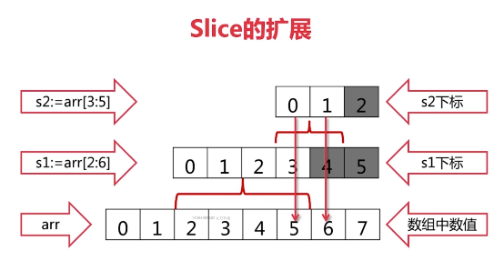
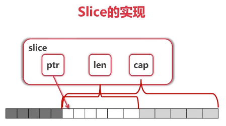

#### 切片

````go
arr := [...] int {0,1,2,3,4,5,6,7}
fmt.Println(arr[2:6])
fmt.Println(arr[:6])
fmt.Println(arr[2:])
fmt.Println(arr[:])

arr := [...] int {0,1,2,3,4,5,6,7}
	
### slice底层没有数据 是对底层array的view 
s1 := arr[2:]
fmt.Println("arr[2:]",s1)
s2 := arr[:]
fmt.Println("arr[:]",s2)

fmt.Println("After updateSlices(s1)")
updateSlice(s1)
fmt.Println(s1)
fmt.Println(arr)
````


##### Reslice


##### slice 的拓展


 

##### slice的实现



slice可以向后使用切片扩展，不能向前扩展

len(s1)   cap(s1) 可以取到


##### 向slice添加元素

````go
maybe new array = append(s1,value)   #可能产生新的array去view
````

- 如果添加元素超过cap容量，系统会重新分配更大的底层数组

- 由于值传递的关系，必须接受append的返回值


##### 创建slice

```go
func printSlice(s [] int) {
	fmt.Printf("len=%d cap=%d\n", len(s), cap(s))
}
func main() {
	var s [] int

	for i := 0; i < 100; i++ {
		printSlice(s)  # 每次扩容两倍
		s = append(s, 2*i+1)
	}
	fmt.Println(s)

	s2 := make([]int, 16)
	printSlice(s2)
	s3 := make([]int, 16, 32)
	printSlice(s3)
}

```

len=90 cap=128
len=91 cap=128
len=92 cap=128
len=93 cap=128
len=94 cap=128
len=95 cap=128
len=96 cap=128
len=97 cap=128
len=98 cap=128
len=99 cap=128
[1 3 5 7 9 11 13 15 17 19 21 23 25 27 29 31 ...  193 195 197 199]
len=16 cap=16
len=16 cap=32


##### copy slice

```go
copy(s2,s1)
```


 ##### del slice element

```go
#删除第三号元素
s2.append(s2[3:],s[4:]...)


#删除头
s2[0]
s2 = s2[1:]

#删除尾
s2[len(s2)-1]
s2 = s2[:len(s2)-1]

```

