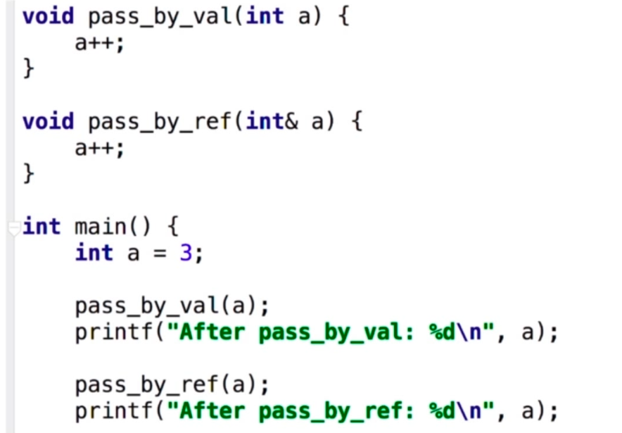

#### 函数


go的函数可以有多个返回值

```GO
func div(a, b int) (q, r int) {
	q = a / b
	r = a % b
	return q, r
}

```


函数式

```go
func eval2(op func(int, int) int, a, b int) int {
	return op(a, b)
}

fmt.Printf("%d\n", eval2(func(a, b int) int {
		return int(math.Pow(float64(a), float64(b)))
}, 2, 3))
```


#### 指针

指针不能运算 比如++

```go
a := 2
var pa *int = &a
*pa = 3
fmt.Print(a)
```


##### 参数传递

 值传递 还是引用传递

c++：




Go只有值传递一种方式

```
func swap(a, b *int){
	*a, *b  = *b ,*a;
}
```


