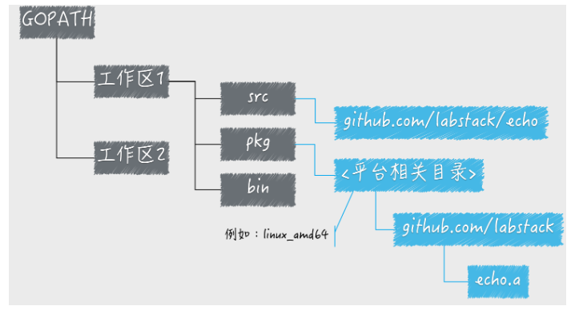

## GO语言环境配置

IDE:Goland

SDK:Go1.11

## 环境变量

- GOROOT：Go语言安装根目录的路径，也就是GO语言的安装路径。
- GOPATH：若干工作区目录的路径。是我们自己定义的工作空间。
- GOBIN：GO程序生成的可执行文件（executable file）的路径,**不允许设置多个路径**。


### Go Path

#### Go Path的意义

你可以把GOPATH简单理解成Go语言的工作目录，它的值是一个目录的路径，也可以是多个目录路径，每个目录都代表Go语言的一个工作区（workspace）。

我们需要利于这些工作区，去放置Go语言的源码文件（source file），以及安装（install）后的归档文件（archive file，也就是以“.a”为扩展名的文件）和可执行文件（executable file）。

```
src: 用来存放源代码文件,（比如：.go .c .h .s等）

bin: bin 编译后生成的可执行文件（为了方便，可以把此目录加入到 `$PATH` 变量中，如果有多个gopath，    那么使用`${GOPATH//://bin:}/bin`添加所有的bin目录）
目录里面存放的都是通过 go install 命令安装后，由 Go 命令源码文件生成的可执行文件。
有两种情况下，bin 目录会变得没有意义。
当设置了有效的 GOBIN 环境变量以后，bin 目录就变得没有意义。
如果 GOPATH 里面包含多个工作区路径的时候，必须设置 GOBIN 环境变量，否则就无法安装 Go 程序的可执行文件。

pkg:用来存放通过 go install 命令安装后的代码包的归档文件(.a 文件)
```



#### 设置GoPath的个人方案

将自己的应用和第三方的包分离,

```
/Users/xxx/go   一个GOPATH,个人的工作空间
├── bin            放所有可执行的命令,包括第三方的
│   ├── echo2
│   ├── glide
│   ├── hello
│   ├── helloworld
│   └── server1
├── src             这里面一个目录就是一个项目
│   └── awesomeProject
│       ├── glide.yaml
│       └── hello
│           └── main.go
└── third           放第三方包的GOPATH
    ├── pkg
    │   └── linux_amd64
    └── src
        ├── github.com
        │   └── Masterminds
        └── gopl.io
            ├── README.md
            ├── ch1
            ├── ch10
            ├── ch11
            ├── ch12
            ├── ch13
```


```shell
#GO
GOROOT=/usr/local/go
export GOROOT
export PATH=$PATH:$GOROOT/bin

GOPATH=~/go/third:~/go
export GOPATH

GOBIN=~/go/bin
export GOBIN


```

从go 1.8开始，GOPATH环境变量现在有一个默认值，如果它没有被设置。 它在Unix上默认为$HOME/go,在Windows上默认为%USERPROFILE%/go。


#### 思考

1.Go语言在多个工作区中查找依赖包的时候是以怎样的顺序进行的？

如果有多个工作区，那么是按照GOPATH里面的先后顺序查找的

2.如果在多个工作区中都存在导入路径相同的代码包会产生冲突吗？ 

不会冲突，像上面说的会按照顺序查找执行


